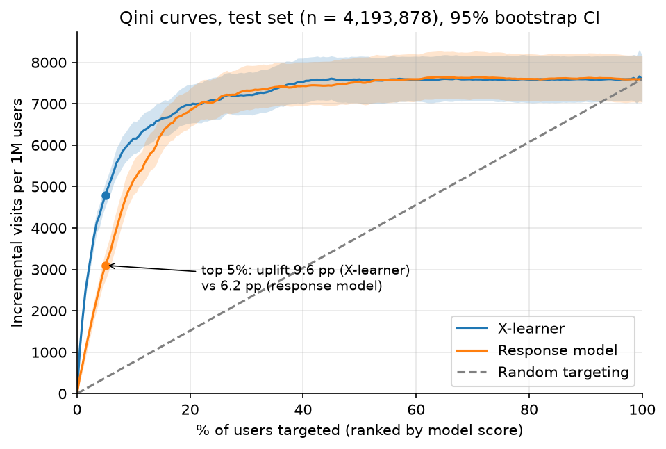
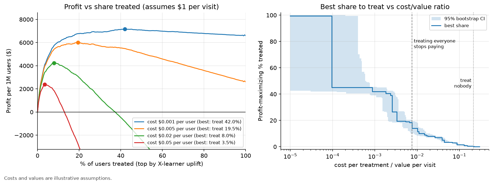

# Uplift and Experimentation Lab (Criteo)

**Business question.** A randomized ad campaign ran on millions of users. Did it work on average, and can we do better
than treating everyone by choosing *whom* to target, given a cost per treatment?

**Short answer.**
- Yes, it worked. Being assigned to the campaign raised the visit rate by **+0.665 pp** (95% CI [+0.640, +0.690]),
  a 17.4% relative lift, after correcting a bias in the pooled data that inflates the naive estimate to +1.034 pp.
- Yes, targeting does better. Ranking users by predicted *uplift* (X-learner) and treating the top 30% captures
  **7,212 of the 7,594 incremental visits per 1M users** (95% of the total; 95% CI [6,732, 7,760]).
- Under illustrative costs ($0.005 per treatment, $1.00 per visit), the profit-maximizing policy treats the top **19.5%**
  (95% CI [14.0%, 26.5%]) and earns **$6,001** per 1M users, 95% CI [$5,554, $6,484], vs $2,594 for treating everyone
  (2.3x).



## Design

- **Data:** Criteo Uplift Prediction Dataset v2.1. **13,979,592 rows**, 12 anonymized features (f0-f11), `treatment`
  (85.0% treated), outcomes `visit` (4.70%, primary) and `conversion` (0.29%, 40,774 events, secondary).
- **A randomized experiment, checked rather than assumed.** No sample-ratio mismatch (treated share 0.8500001 vs the
  documented 0.85, p = 0.999). All features are balanced (max |SMD| 0.049). But a classifier predicts treatment from features
  slightly better than chance (AUC 0.507, 95% CI [0.504, 0.510]). The data pools several tests, so assignment is random
  only *conditional on features*. Among the users most likely to visit anyway, 86.5% were treated rather than 85%, which inflates
  the simple difference in means. Headline effects are therefore covariate-adjusted, and model evaluation is propensity-weighted.
- **`exposure` is post-treatment** (only 3.6% of treated users actually saw an ad). It is never used as a feature, and the
  code asserts this. Effects are intent-to-treat.
- **Uplift models** (LightGBM, learner logic written by hand): response model (baseline), T-learner, S-learner, X-learner.
  Stratified 60/10/30 train/validation/test split; light tuning and model selection on validation only; 3 seeds.
- **Evaluation** on 4,193,878 held-out users: propensity-weighted Qini/uplift curves, AUUC and uplift@k, with 200 paired
  bootstrap resamples. A random score is run through the same pipeline as a sanity check.

## Results

### 1. Average effect (full data, intent-to-treat)

| Outcome | Effect (adjusted, headline) | 95% CI | Relative | Naive difference in means |
|---|---|---|---|---|
| Visit | +0.665 pp | [+0.640, +0.690] | 17.4% | +1.034 pp [+1.006, +1.063] |
| Conversion | +0.102 pp | [+0.095, +0.108] | 52.5% | +0.115 pp [+0.108, +0.122] |

A model-light cross-check (compare the arms within 20 bins of predicted visit probability) gives +0.691 pp [+0.666, +0.717].

### 2. Power and variance reduction

- Minimum detectable effect at 80% power with 1M users: **4.0%** relative for visit, **18.8%** for conversion.
  80% power at the observed effect needs ~24,597 users for visit and ~123,116 for conversion. Analytical power matches a
  200-subsample simulation.
- Covariate adjustment (Lin estimator, robust SE) cuts the variance of the visit effect by **19.5%** (23.8% with
  an ML outcome score) and conversion by only **2.3%**. A 0.3% outcome is mostly irreducible noise. The features are
  anonymized pre-treatment covariates, not a pre-period metric, so this is regression adjustment, not CUPED.

### 3. Who to target: uplift models on the test set

| Model | AUUC per 1M users | 95% CI | Uplift in top 5% | Uplift in top 10% |
|---|---|---|---|---|
| S-learner | 3,350 | [3,147, 3,580] | 9.4 pp | 6.1 pp |
| X-learner (selected) | 3,298 | [3,066, 3,549] | 9.6 pp | 6.2 pp |
| Response model | 3,109 | [2,909, 3,367] | 6.2 pp | 5.2 pp |
| T-learner | 3,061 | [2,825, 3,301] | 9.0 pp | 5.8 pp |
| Random score | -132 | [-294, 26] | 0.6 pp | 0.6 pp |

AUUC is the area between the uplift curve and random targeting, in incremental visits per 1M users. The model was selected on
validation; on test the X- and S-learners are statistically tied (paired bootstrap, Bonferroni-corrected).

**Why not just target likely visitors?** The response model's whole-curve AUUC is close to the uplift learners', but at the top
of the ranking, where budgets bind, it falls behind. Uplift in the top 5% is +6.2 pp [+5.4, +6.8] for the response model vs
+9.6 pp [+9.0, +10.2] for the X-learner. The response model's top 10% already visit 32.2% of the time without the ad
(only 14% of their visits are incremental). The X-learner's top 10% visit 22.1% of the time without it
(22% incremental).

### 4. Policy and economics (illustrative costs)



| Cost / value | Best share to treat | 95% CI | Profit at best k (units of v) | Treat everyone |
|---|---|---|---|---|
| 0.001 | 42.0% | [39.0%, 45.5%] | 7,158 | 6,594 |
| 0.005 | 19.5% | [14.0%, 26.5%] | 6,001 | 2,594 |
| 0.01 | 14.0% | [8.5%, 18.5%] | 5,190 | -2,406 |
| 0.02 | 8.0% | [7.0%, 10.0%] | 4,253 | -12,406 |
| 0.05 | 3.5% | [3.5%, 5.0%] | 2,424 | -42,406 |
| 0.1 | 1.5% | [1.5%, 2.0%] | 968 | -92,406 |
| 0.2 | 0.5% | [0.0%, 0.5%] | 57 | -192,406 |

- Treating everyone breaks even at cost/value = **0.0076**. Targeting stays profitable up to **0.215** [0.188, 0.241],
  a 28x wider range. Beyond that, treat nobody.
- The ranking model matters most when treatment is expensive. At cost/value 0.05, ranking by the X-learner earns 2,390
  [2,146, 2,649] per 1M users (in units of v) vs 610 [324, 893] for the response model.

## Simulator

`app/streamlit_app.py` reads only `results/curves.json` (never the raw data). It has sliders for the targeting share, cost per
treatment and value per visit, and shows incremental visits with the CI band, profit, the profit-maximizing share, and an
optional response-model comparison. Cost/value assumptions are labelled as illustrative in the app.

## Limitations

- **Rare outcome.** Conversion is 0.29% of rows, so intervals are wide. We model visit and report conversion as secondary.
- **Anonymized, randomly projected features.** There is no way to interpret *who* the high-uplift users are, and no pre-period metric
  for CUPED.
- **One pooled experiment.** The public data combines several tests and was subsampled non-uniformly. Effects hold for this
  dataset, not as Criteo's real campaign lift. Adjustment and propensity weighting reduce, but cannot guarantee away, the
  resulting imbalance (IPW moves the test effect from ~1.03 pp to +0.759 pp, not all the way to the adjusted +0.665 pp).
- **Short-term, single campaign.** No long-term effects, ad fatigue, carry-over or competition between campaigns. Costs and values are
  illustrative.
- **Optimistic optimum.** The profit-maximizing share is chosen and valued on the same test curve (a winner's curse). The bootstrap
  interval on k shows how stable the choice is.

## How to run

```bash
conda create -n uplift python=3.11 && conda activate uplift
pip install -r requirements.txt
python run_all.py --stage all        # downloads ~300 MB, then S0/S1 -> S6 (the full run takes ~1.5 h on a laptop CPU)
python run_all.py --stage s3 --dev   # quick run of the models on the 1M-row development sample
pytest -q                            # 17 tests: statistics, learners, evaluation, leakage guard, app
streamlit run app/streamlit_app.py   # the simulator
```

Stages: `s01` load, integrity and ATE; `s2` power and adjustment; `s3` uplift models; `s4` evaluation; `s5` policy;
`s6` this README and the memo. Every analysis decision (and every mistake caught along the way) is logged in
[docs/decisions.md](docs/decisions.md). The stakeholder summary is in [docs/memo.md](docs/memo.md).

```
src/     load  integrity  ate  power  adjust  uplift_models  evaluate  policy  report  plotting  common
app/     streamlit_app.py            results/  results.json  curves.json  figures/
docs/    decisions.md  memo.md       tests/    run_all.py  requirements.txt
```

## Data source and licence

Criteo Uplift Prediction Dataset v2.1, Criteo AI Lab: <https://huggingface.co/datasets/criteo/criteo-uplift>
(also <https://ailab.criteo.com/criteo-uplift-prediction-dataset/>). Licence: **CC BY-NC-SA 4.0** (non-commercial,
attribution, share-alike). The raw data is not redistributed here. Reference: Diemert, Betlei, Renaudin, Amini, *A Large Scale
Benchmark for Uplift Modeling*, AdKDD 2018.

*README generated by `src/report.py` from `results/results.json`.*
